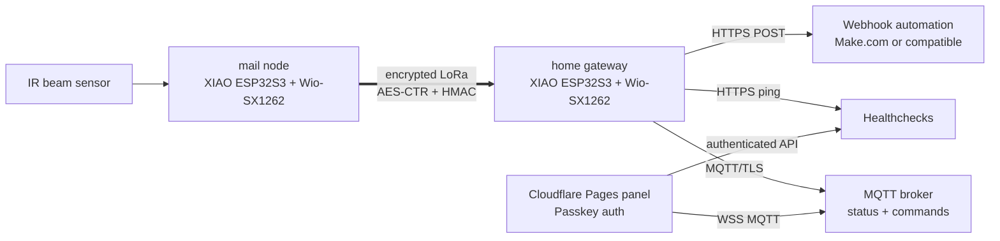

# Architecture



## Firmware Roles

`home` is the always-powered gateway:

- receives encrypted LoRa packets
- posts delivery and health alerts to a webhook
- pings Healthchecks when the mailbox node heartbeat is fresh
- publishes retained MQTT state
- accepts reset/debug/test commands from MQTT and sends LoRa downlinks

`mail` is the mailbox node:

- samples the active-low IR beam input
- latches `DELIVERED` until a reset downlink arrives
- sends heartbeats with battery and sampling state
- persists delivery state and event sequence in NVS

## Packet Format

LoRa payloads are framed as:

```text
magic(4) | counter(4) | nonce(16) | len(2) | AES-CTR ciphertext | HMAC-SHA256 tag(16)
```

The key material is derived from `LORA_MAIL_KEY` in `firmware/include/lora_mail_config.h`. Keep that file local and rotate the key if it is exposed.

## MQTT Topics

The default panel topic prefix is `mailbox`.

| Topic | Retained | Direction | Purpose |
| --- | --- | --- | --- |
| `mailbox/status` | yes | home -> panel | Current mailbox state, reset flag, event sequence, battery alert |
| `mailbox/heartbeat` | yes | home -> panel | Last mailbox heartbeat, battery, uptime, mode |
| `mailbox/gateway` | yes | home -> panel | Gateway LWT: `online` or `offline` |
| `mailbox/reset` | no | panel -> home | Mark collected and reset the mailbox node |
| `mailbox/command` | no | panel -> home | `hb`, `test`, `debug`, `normal` |
| `mailbox/mode` | yes | panel -> home | Retained debug/normal mode request |

## Panel Security

The browser never receives MQTT credentials until it has a valid Worker session cookie. The Worker validates a WebAuthn/passkey challenge, creates a 30-day session, and then allows access to static panel assets plus `/api/config`.

Registration is intentionally controlled by `SETUP_TOKEN`. Remove that environment variable after the owner passkey is registered.

## Distribution Surfaces

The project is distributed through three public surfaces:

- The Git repository for source, documentation, CI, issues, and security advisories.
- GitHub Releases for pinned, checksumed release artifacts such as example firmware builds and web panel bundles.
- GitHub Packages for the reusable Cloudflare panel package `@feierbuqiu/lora-mailbox-panel`.

Firmware remains source-first because production binaries depend on private WiFi, LoRa, webhook, MQTT, and Healthchecks values. The published firmware archive is an example build for inspection and smoke testing, not a credential-bearing deployment image.
