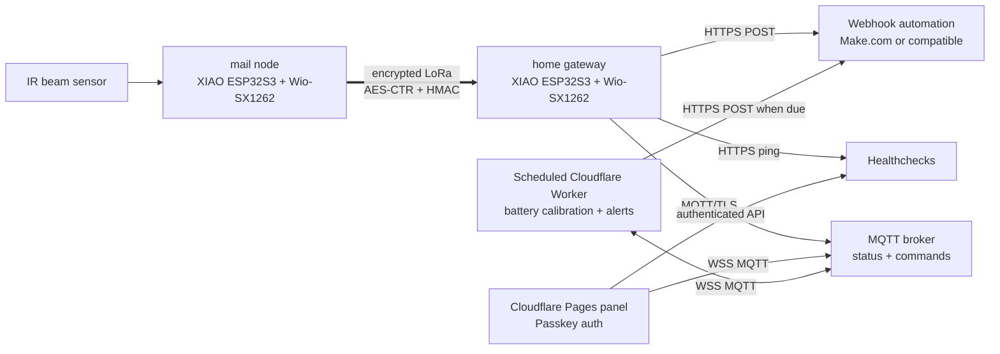

# Architecture



## Firmware Roles

`home` is the always-powered gateway:

- receives encrypted LoRa packets
- posts delivery and battery alerts to a webhook
- keeps late/offline heartbeat state in MQTT for the panel, without webhook email
- pings Healthchecks when the mailbox node heartbeat is fresh; Healthchecks is the single sustained-link email escalation path
- publishes retained MQTT state
- accepts reset/debug/test commands from MQTT and sends LoRa downlinks

`mail` is the mailbox node:

- samples the active-low IR beam input
- latches `DELIVERED` until a reset downlink arrives
- sends heartbeats with battery and sampling state
- persists delivery state and event sequence in NVS

## Packet Format

LoRa payloads are framed as:

```text
magic(4) | counter(4) | nonce(16) | len(2) | AES-CTR ciphertext | HMAC-SHA256 tag(16)
```

The key material is derived from `LORA_MAIL_KEY` in `firmware/include/lora_mail_config.h`. Keep that file local and rotate the key if it is exposed.

## MQTT Topics

The default panel topic prefix is `mailbox`.

| Topic | Retained | Direction | Purpose |
| --- | --- | --- | --- |
| `mailbox/status` | yes | home -> panel + cloud monitor | Raw current mailbox state, reset flag, event sequence, and node-reported battery fields |
| `mailbox/heartbeat` | yes | home -> panel + cloud monitor | Raw last mailbox heartbeat, battery, uptime, and mode |
| `mailbox/status-calibrated` | yes | cloud monitor -> panel | Stable calibrated battery status and alert level |
| `mailbox/heartbeat-calibrated` | yes | cloud monitor -> panel | Stable calibrated voltage, percentage, raw audit fields, and filter metadata |
| `mailbox/gateway` | yes | home -> panel | Gateway LWT: `online` or `offline` |
| `mailbox/reset` | no | panel -> home | Mark collected and reset the mailbox node |
| `mailbox/command` | no | panel -> home | `hb`, `test`, `debug`, `normal` |
| `mailbox/mode` | yes | panel -> home | Retained debug/normal mode request |
| `mailbox/battery-cloud-state` | yes | cloud monitor -> cloud monitor | Distinct voltage samples, filter state, alert level, and cooldown state |

## Cloud Battery Correction

The optional `cloud-battery-monitor/` Worker is deliberately outside the embedded firmware path. It is intended for installed mailbox nodes that cannot be retrieved and reflashed economically.

Once per minute, the Worker reads retained raw heartbeat, raw status, and battery-cloud-state topics over MQTT WSS. It only processes a new raw heartbeat timestamp, applies the deployment's `BATTERY_OFFSET_MV`, keeps the latest five corrected samples, takes their median, rounds the panel value to 10 mV, and calculates percentage linearly with 3.3 V as 0% and 4.2 V as 100%. It publishes the result on dedicated `mailbox/heartbeat-calibrated` and `mailbox/status-calibrated` topics. The gateway remains the sole writer of the raw topics, and the Worker remains the sole writer of the calibrated topics, eliminating retained-value races.

Published payloads carry `calibrated`, `raw_mv`, calibration metadata, and filter sample count fields. During an upgrade from the shared-topic design, the Worker copies one retained calibrated legacy payload into the dedicated topics before normal processing resumes. Low and critical notifications use hysteresis plus a 24-hour repeat cooldown; retained MQTT state removes the need for a separate database binding.

## Panel Security

The browser never receives MQTT credentials until it has a valid Worker session cookie. The Worker validates a WebAuthn/passkey challenge, creates a 30-day session, and then allows access to static panel assets plus `/api/config`.

Registration is intentionally controlled by `SETUP_TOKEN`. Remove that environment variable after the owner passkey is registered.

## Distribution Surfaces

The project is distributed through three public surfaces:

- The Git repository for source, documentation, CI, issues, and security advisories.
- GitHub Releases for pinned, checksumed release artifacts such as example firmware builds and web panel bundles.
- GitHub Packages for the reusable Cloudflare panel package `@feierbuqiu/lora-mailbox-panel`.
- Release source bundles for the scheduled cloud battery monitor, which stays deployment-configured rather than embedding a site-specific calibration.

Firmware remains source-first because production binaries depend on private WiFi, LoRa, webhook, MQTT, and Healthchecks values. The published firmware archive is an example build for inspection and smoke testing, not a credential-bearing deployment image.
